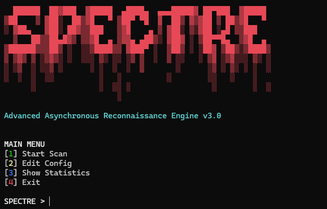
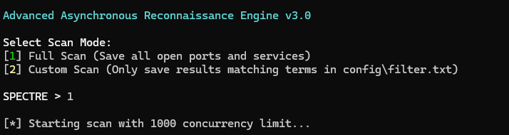
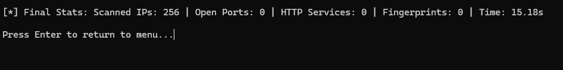

# SPECTRE Scanner v3.0


**SPECTRE** is a High-Performance Asynchronous Reconnaissance Engine and Port Scanner. It leverages `asyncio` and `aiohttp` to perform lightning-fast mass scanning, banner grabbing, and HTTP title extraction with an extremely low memory footprint.

Developed by [Halim](https://github.com/WhoIsHalim).

---

## 📸 Screenshots

*(You can add your actual screenshots to the `screenshots/` folder later and they will appear here)*

### Main Menu


### Scanning in Progress


### Viewing Statistics


---

## ✨ Features

- 🚀 **High Performance:** Completely asynchronous (Non-blocking I/O).
- 🧠 **Smart Memory Management:** Uses streaming IP architecture to prevent RAM exhaustion on massive subnets.
- 🎯 **Advanced Fingerprinting:** Regex-based signature matching engine to identify protocols, web servers, and specific services.
- 🕵️ **Banner Grabbing:** Protocol-aware banner extraction.
- 📊 **Rich Reporting:** Exports data automatically in `TXT`, `CSV`, `JSON`, and `SQLite`.
- 🛡️ **Custom Filters:** Target specific technologies or terms and ignore everything else.
- 💻 **Cross-Platform:** Beautiful Terminal UI that works flawlessly on both Windows and Linux.
- 🚦 **Rate Limiting:** Built-in connection throttlers (`asyncio.Semaphore`) to avoid socket exhaustion.

---

## ⚙️ Installation

1. Clone the repository:
   ```bash
   git clone https://github.com/WhoIsHalim/SPECTRE-Scanner.git
   cd SPECTRE-Scanner
   ```

2. Install the required dependencies:
   ```bash
   pip install -r requirements.txt
   ```

---

## 📖 Detailed Usage Guide

Run the main file to launch the interactive Terminal UI:
```bash
python main.py
```

Upon launching the tool for the first time, a `config/` directory is automatically generated containing default configuration files.

### 1. Preparing Your Targets
Before starting a scan, you need to tell SPECTRE what to look for. Select **[2] Edit Config** from the menu or open the `config/` folder directly to modify these files:

- **`config/ip_ranges.txt`**: Add your targets here. You can add single IPs (e.g., `192.168.1.1`) or entire CIDR blocks (e.g., `10.0.0.0/16`). SPECTRE processes these one by one to save memory.
- **`config/ports.txt`**: Define the ports you want to scan. You can specify individual ports (e.g., `80, 443`) or ranges (e.g., `8080-8090`).
- **`config/fingerprints.json`**: This is the brain of the scanner. Add regex patterns here to detect specific software versions from banners or HTTP titles.

### 2. Starting a Scan
Select **[1] Start Scan** from the main menu. You will be prompted to choose a scan mode:

- **[1] Full Scan:** 
  The scanner will attempt to connect to all specified targets and ports. Every open port, grabbed banner, and discovered HTTP service will be saved to your reports.
  
- **[2] Custom Scan:** 
  In this mode, SPECTRE acts like a sniper. It will read the keywords you placed in **`config/filter.txt`** (e.g., "Apache", "Mikrotik", "Router"). If a scanned target's banner or title contains any of these keywords, it gets saved. If it doesn't, it is ignored and dropped. This is incredibly useful for targeted hunting.

### 3. Graceful Shutdown
During any scan, if you need to stop, simply press `CTRL+C`. SPECTRE handles this gracefully—it stops fetching new targets, safely closes existing connections, and saves all data gathered up to that point without corruption.

### 4. Viewing Results & Statistics
All discovered data is saved automatically in the `reports/` folder in four different formats:
- `report.txt` (Human readable)
- `report.json` (For automation pipelines)
- `report.csv` (For spreadsheet analysis)
- `report.db` (SQLite database for SQL querying)

You can select **[3] Show Statistics** from the main menu at any time to see the file sizes and verify how much data has been gathered.

---

## 📜 License

This project is licensed under the MIT License - see the [LICENSE](LICENSE) file for details.
